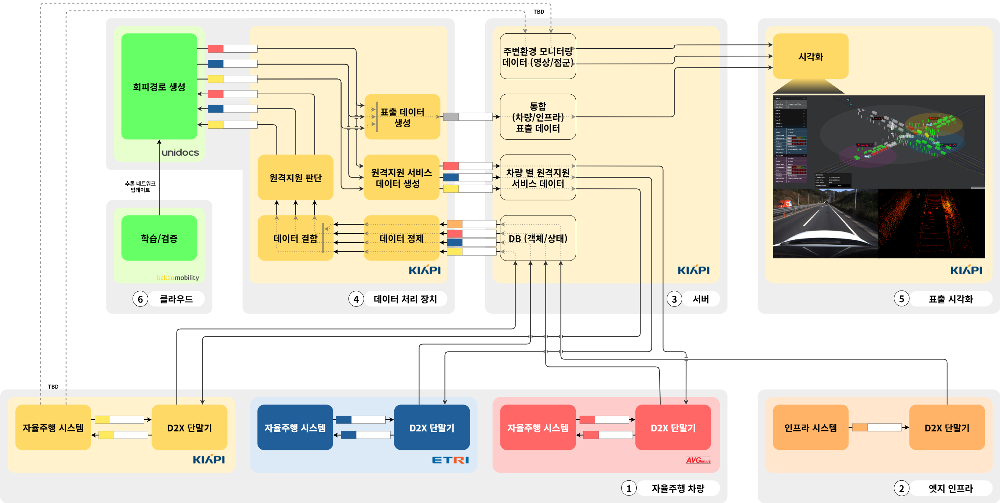
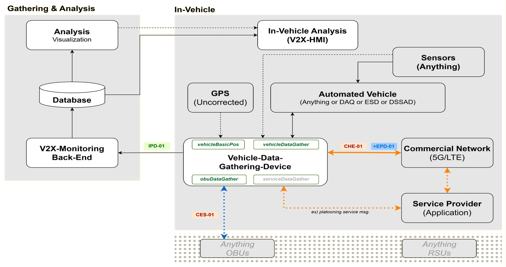
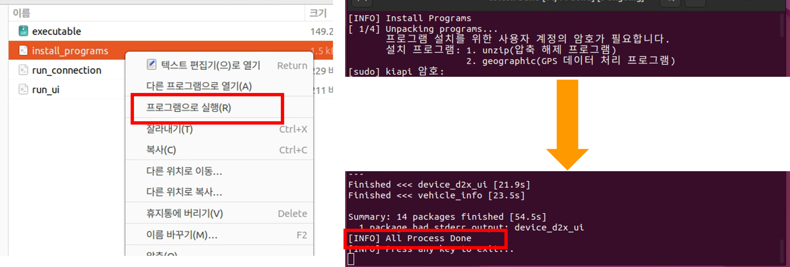
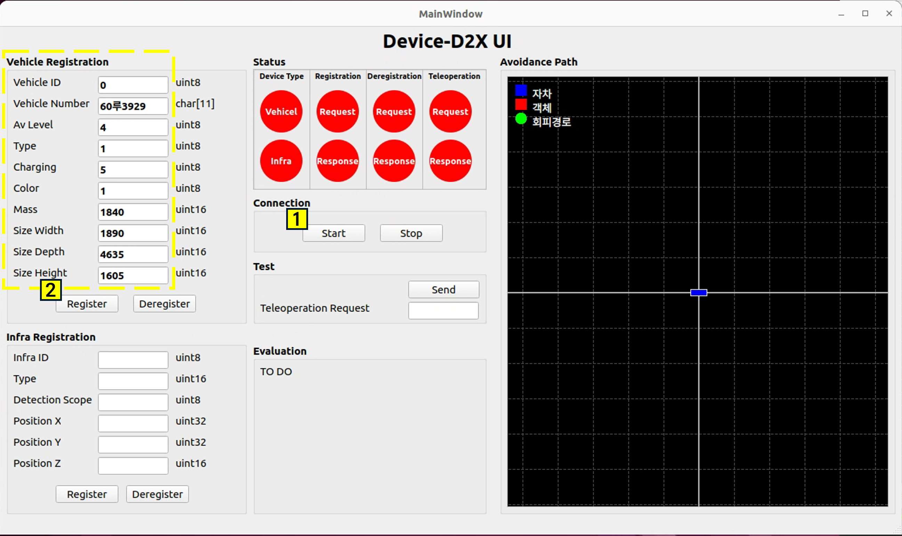
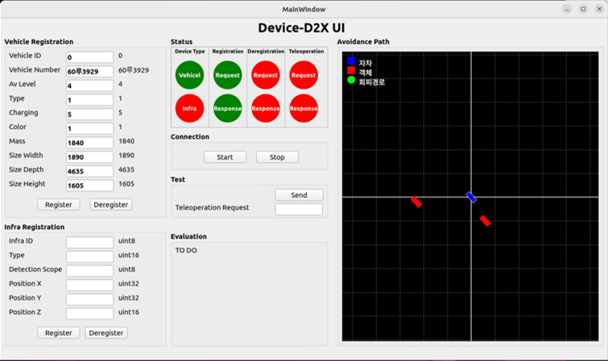
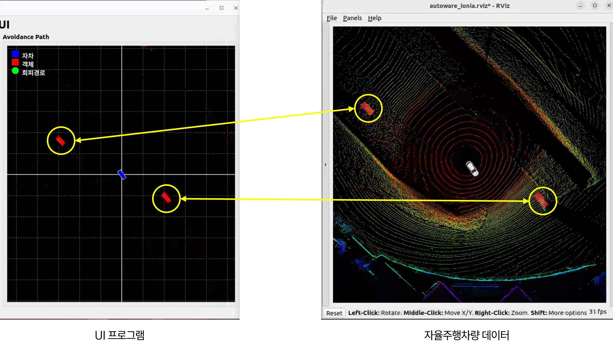
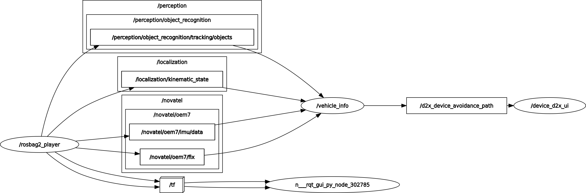

# KIAPI D2X Connection

## 개요  
</img>
**(과-22) 클라우드 기반 자율주행 차량 오류 및 한계 상황 지능형 원격지원 기술 개발**  
Device-D2X 통신 위한 프로그램

## Device-D2X 통신  
</img>
자율주행차량의 정보를 원격지원 서버로 전송하기 위한 통신 장비  

## 실행 환경
Ubuntu 22.04  
ROS2 Humble  
KIAPI D2X Device

## A. 파일 다운로드
```shell
git clone
```

## B. 프로그램 설치
</img>
```shell
cd kiapi_d2x_connection
./install_programs
```
## C. 프로그램 실행
</img>
```shell
./run_connection
```

## D. 접속 및 차량 등록
</img>
1. Start: D2X 장치 접속
2. Register: 차량 정보 입력 및 등록 요청

## E. 등록 완료
</img>
1. 상태 출력
   D2X 접속 상태: Vehicle 활성화 (녹색)  
   장치 등록 요청: Request 활성화 (녹색)    
   장치 등록 요청 승인: Response 활성화 (녹색)  
2. 시각화 출력


</img>

## F. 프로그램 구조
</img>

### Published Topics
> D2X 송수신 데이터  
/device_d2x_vehicle_info (vehicle_msgs/DeviceD2XVehicleInfoTransmit)  
/device_d2x_transmit_info (comm_perform_msgs/CommPerformTransmit)  

### Subscribed Topics
> 인지 객체  
/perception/object_recognition/tracking/objects (autoware_perception_msgs/TrackedObjects)  

> GNSS, IMU 정보  
/novatel/oem7/imu/data (sensor_msgs/Imu)
/novatel/oem7/fix (sensor_msgs/NavSatFix)

> 차량 정보  
/localization/kinematic_state (nav_msgs/Odometry)
/vehicle_info/vehicle_status/can (vehicle_msgs/DeviceD2XVehicleInfoTransmit)


### Service  
> D2X 접속 및 연결 요청  
/device_d2x_connection (device_msgs/DeviceCommunication)
/device_d2x_registration (device_msgs/DeviceRegistration)


### Action  
> D2X 접속 상태  
/device_d2x_status (device_msgs/DeviceStatus)

